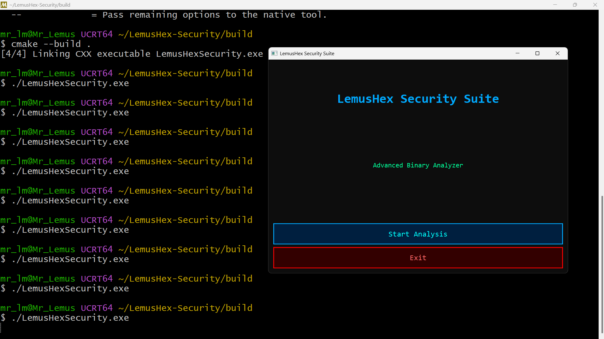

<h1 align="center">⚡ LemusHex Security Suite ⚡</h1>

Native Windows Cybersecurity Toolkit built in Modern C++ + Qt6

💀 Reverse Engineering • Hex Analysis • Malware Triage • Native Performance 💀

  

---

## 🚀 Current Progress

✅ Native desktop application running  
✅ Qt6 GUI implemented  
✅ Professional dark premium interface  
✅ Build system configured with CMake + Ninja  
✅ Windows executable generated  
🔄 Next phase: Real Hex Engine + File Analysis

---

## 💀 Core Features

- Native Windows GUI
- Hex editor engine (in progress)
- Binary pattern scanning
- SHA256 / MD5 hashing
- Malware triage modules
- Reverse engineering utilities
- High performance C++ architecture

---

## 🛠 Tech Stack

C++ • Qt6 • GCC • CMake • Ninja • MSYS2 • Windows API

---

## 📍 Roadmap

### v0.1
GUI Prototype ✅

### v0.2
Start Analysis functional

### v0.3
Hex Viewer Engine

### v0.4
Hash Scanner + File Inspector

### v1.0
Professional Release

---

## 👨‍💻 Author

**José Lemus**  
Cybersecurity • Systems Engineering • Software Development

> ⚡ *"I love what I do, and when I do it, I do it well."*
